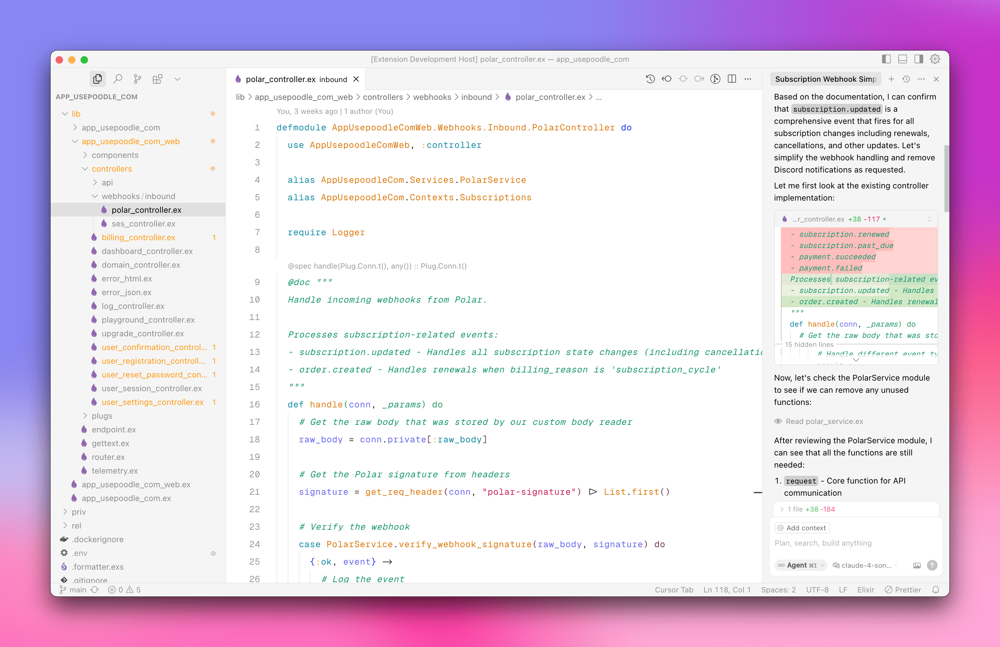

# Cursor Light Theme

The missing light theme for Cursor.

## Installation

1. Go to Extensions (⌘⇧X)
2. Search for `Cursor Light Theme`
3. Click `Install`

## Usage

1. Go to Command Palette (⌘⇧P)
2. Type `Preferences: Color Theme`
3. Select `Cursor Light`
